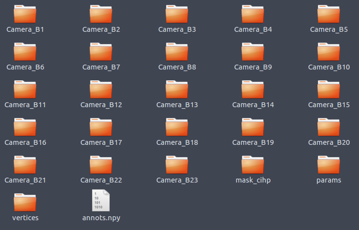

## Run the code on the custom dataset

Please inform me if there is any problem to run the code on your own data.

1. If your data already have SMPL parameters, just export the SMPL parameters and SMPL vertices to two directories `params` and `vertices`. If you do not have SMPL parameters, you could take the following ways:
    * For a multi-view video, you could estimate SMPL parameters using [https://github.com/zju3dv/EasyMocap](https://github.com/zju3dv/EasyMocap). The output parameter files can be processed using the [script](https://github.com/zju3dv/neuralbody/blob/master/zju_smpl/easymocap_to_neuralbody.py).
    * For a monocular video, you could estimate SMPL parameters using [https://github.com/thmoa/videoavatars](https://github.com/thmoa/videoavatars). The output `reconstructed_poses.hdf5` file can be processed following [the instruction](https://github.com/zju3dv/neuralbody#process-people-snapshot).
2. Organize the dataset as the following structure. Please refer to `CoreView_392` of ZJU-MoCap dataset as an example.  
 The `annots.npy` is generated by [get_annots.py](get_annots.py). This code is used here to show the format of `annots.npy`. Please revise it according to your input camera parameters and image paths.  
Example camera files can be found in [camera_params](camera_params).
    
    

    ```
    ├── /path/to/dataset
    │   ├── annots.npy  // Store the camera parameters and image paths.
    │   ├── params
    │   │   ├── 0.npy
    │   │   ├── ...
    │   │   ├── 1234.npy
    │   ├── vertices
    │   │   ├── 0.npy
    │   │   ├── ...
    │   │   ├── 1234.npy
    │   ├── Camera_B1  // Store the images. No restrictions on the directory name.
    │   │   ├── 00000.jpg
    │   │   ├── ...
    │   ├── Camera_B2
    │   │   ├── 00000.jpg
    │   │   ├── ...
    │   ├── ...
    │   ├── Camera_B23
    │   │   ├── 00000.jpg
    │   │   ├── ...
    │   ├── mask_cihp  // Store the foreground segmentation. The directory name must be "mask_cihp".
    │   │   ├── Camera_B1
    │   │   │   ├── 00000.png
    │   │   │   ├── ...
    │   │   ├── Camera_B2
    │   │   │   ├── 00000.png
    │   │   │   ├── ...
    │   │   ├── ...
    │   │   ├── Camera_B23
    │   │   │   ├── 00000.png
    │   │   │   ├── ...
    ```
4. Use `configs/multi_view_custom.yaml` or `configs/monocular_custom.yaml` for training. **Note that you need to revise the `train_dataset` and `test_dataset` in the yaml file.**
    ```
    # train from scratch
    python train_net.py --cfg_file configs/multi_view_custom.yaml exp_name <exp_name> resume False
    # resume training
    python train_net.py --cfg_file configs/multi_view_custom.yaml exp_name <exp_name> resume True
    ```
    Revise the `num_train_frame` and `training_view` in `custom.yaml` according to your data. Or you could specify it in the command line:
    ```
    python train_net.py --cfg_file configs/custom.yaml exp_name <exp_name> num_train_frame 1000 training_view "0, 1, 2, 3" resume False
    ```
6. Visualization. Please refer to [Visualization on ZJU-MoCap](https://github.com/zju3dv/neuralbody#visualization-on-zju-mocap) as an example.
    * Visualize novel views of single frame.
    ```
    python run.py --type visualize --cfg_file configs/multi_view_custom.yaml exp_name <exp_name> vis_novel_view True num_render_views 100
    ```

    * Visualize views of dynamic humans with fixed camera
    ```
    python run.py --type visualize --cfg_file configs/multi_view_custom.yaml exp_name <exp_name> vis_novel_pose True num_render_frame 1000 num_render_views 1
    ```

    * Visualize views of dynamic humans with rotated camera
    ```
    python run.py --type visualize --cfg_file configs/multi_view_custom.yaml exp_name <exp_name> vis_novel_pose True num_render_frame 1000
    ```

    * Visualize mesh. `mesh_th` is the iso-surface threshold of Marching Cube Algorithm.
    ```
    # generate meshes
    python run.py --type visualize --cfg_file configs/multi_view_custom.yaml exp_name <exp_name> vis_mesh True mesh_th 10
    # visualize a specific mesh
    python tools/render_mesh.py --exp_name <exp_name> --dataset zju_mocap --mesh_ind 0
    ```
